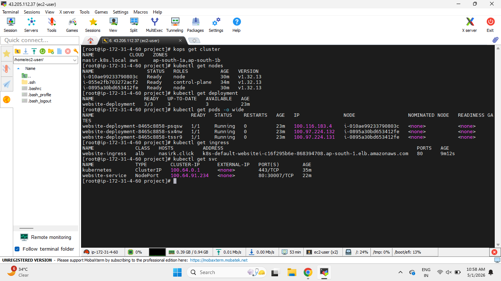
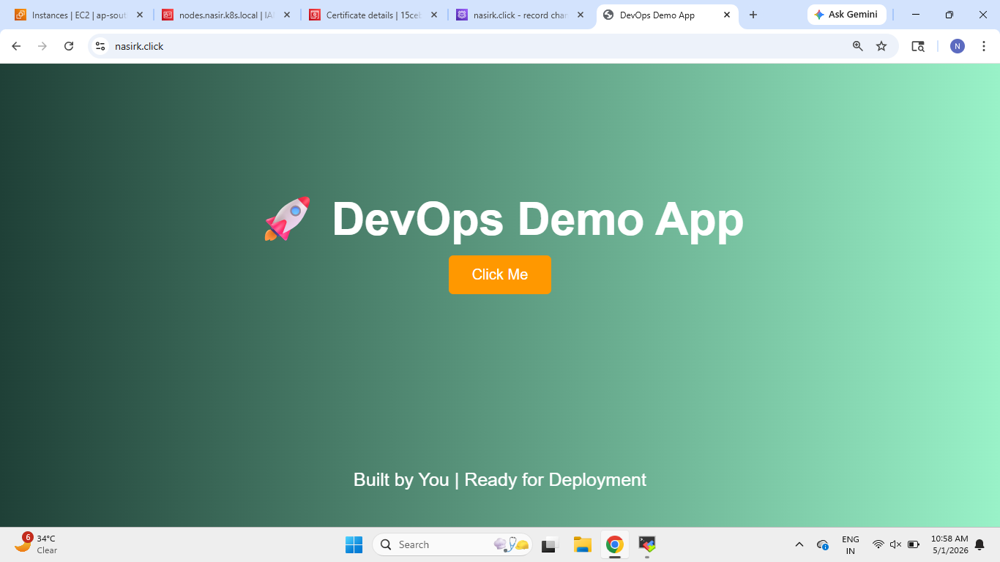
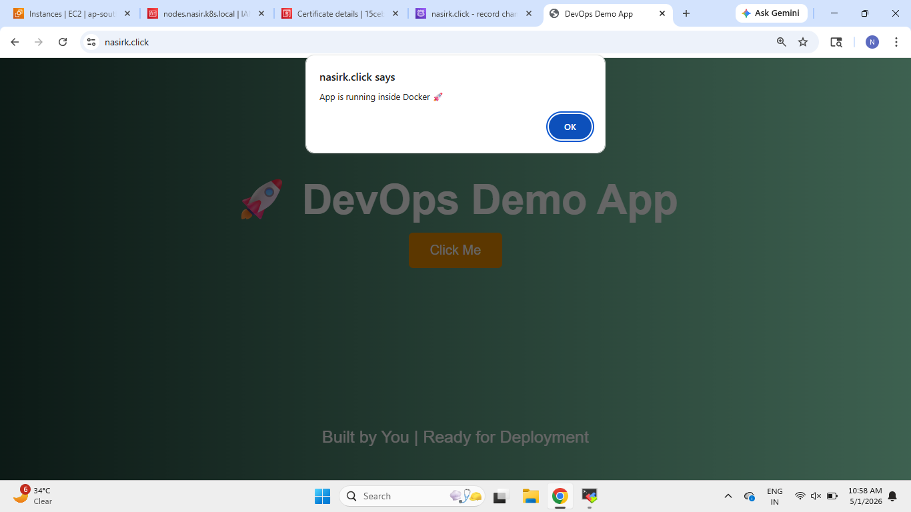

# Kubernetes ALB Ingress Demo

--------------------------------------------------

# Project Overview

This project demonstrates how to deploy a containerized application on Kubernetes using:

- KOPS Kubernetes Cluster
- AWS ALB Ingress Controller
- NodePort Service
- Domain Routing
- HTTPS using AWS ACM
- Liveness Probe
- Readiness Probe
- High Availability using Multiple Replicas

The application is exposed using the custom domain:

```bash
nasirk.click
```

--------------------------------------------------

# Architecture Flow

```text
User
   ↓
AWS ALB Ingress
   ↓
NodePort Service
   ↓
Kubernetes Pods
```

--------------------------------------------------

# Technologies Used

- AWS EC2
- Kubernetes
- KOPS
- AWS ALB Ingress Controller
- Docker
- YAML
- ACM SSL Certificate
- NodePort Service
- Ingress
- Health Probes

--------------------------------------------------

# Project Files

## deployment.yml

Used to create Kubernetes deployment and manage pods.

Features:
- 3 replicas
- Container deployment
- Liveness Probe
- Readiness Probe

--------------------------------------------------

## service.yml

Used to expose Kubernetes application internally using NodePort service.

```yaml
type: NodePort
nodePort: 30007
```

--------------------------------------------------

## ingress.yml

Used to expose application externally using AWS ALB Ingress.

Features:
- Domain routing
- HTTPS redirect
- SSL certificate integration
- Internet-facing ALB

--------------------------------------------------

## get_helm.sh

Used to install Helm inside the Kubernetes environment.

--------------------------------------------------

# Kubernetes Deployment Configuration

## Replicas

```yaml
replicas: 3
```

Purpose:
- High Availability
- Load Distribution
- Fault Tolerance

--------------------------------------------------

# Health Probes

## Liveness Probe

Definition:

Liveness Probe checks whether the container is alive or not.

If the probe fails:
- Kubernetes restarts the container automatically.

--------------------------------------------------

## Readiness Probe

Definition:

Readiness Probe checks whether the application is ready to receive traffic or not.

If the probe fails:
- Traffic is not sent to that pod.

--------------------------------------------------

# HTTPS Configuration

The project uses AWS ACM certificate for HTTPS.

```yaml
alb.ingress.kubernetes.io/certificate-arn
```

Purpose:
- Secure HTTPS communication
- SSL encryption
- Production-ready setup

--------------------------------------------------

# AWS ALB Ingress

This project uses:

```yaml
ingressClassName: alb
```

Purpose:
- Automatically creates AWS Application Load Balancer
- Routes traffic using domain
- Supports HTTPS termination

--------------------------------------------------

# Domain Configuration

Custom domain used:

```bash
nasirk.click
```

Traffic Flow:

```text
Domain → AWS ALB → NodePort Service → Kubernetes Pods
```

--------------------------------------------------

# Service Configuration

Service Type:

```yaml
type: NodePort
```

Purpose:
- Exposes Kubernetes application on worker node ports
- Allows ALB to forward traffic to Kubernetes pods

--------------------------------------------------

# Deployment Verification Commands

## Check Cluster

```bash
kops get cluster
```

## Check Nodes

```bash
kubectl get nodes
```

## Check Deployment

```bash
kubectl get deployment
```

## Check Pods

```bash
kubectl get pods -o wide
```

## Check Ingress

```bash
kubectl get ingress
```

## Check Services

```bash
kubectl get svc
```

--------------------------------------------------

# Project Screenshots

## 1. Kubernetes Cluster and Resources

This screenshot shows:
- Kubernetes cluster
- Worker nodes
- Deployment
- Running pods
- Ingress
- Services



--------------------------------------------------

## 2. Application Homepage

This screenshot shows the deployed application running successfully using the custom domain.



--------------------------------------------------

## 3. Application Functionality Verification

This screenshot shows the application button functionality working successfully inside the deployed containerized application.



--------------------------------------------------

# Final Outcome

Successfully deployed a Kubernetes application on AWS using:

- KOPS Cluster
- AWS ALB Ingress
- NodePort Service
- HTTPS ACM Certificate
- Domain Routing
- Liveness and Readiness Probes
- High Availability Architecture

--------------------------------------------------

# Author

Nasir Khatib

--------------------------------------------------
